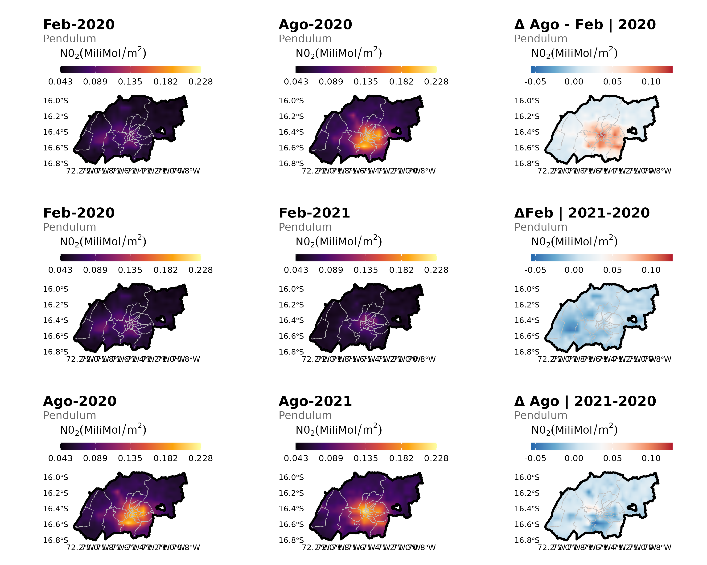

<h1 align="center"><b>Environmental Analysis</b></h1>

  <a href="https://www.rstudio.com/products/rstudio/download/">    <a href="https://www.instagram.com/pendulum_peru/?hl=es"> </a href="https://github.com/pendulum-pe"> 

## **General information**

Source | spatial resolution | link
---|---|---
European Union - ESA - Copernicus | 1113.2 meters | [**European Union-ESA-Copernicus**](https://developers.google.com/earth-engine/datasets/catalog/COPERNICUS_S5P_NRTI_L3_SO2)

Regions | Source | link
---|---|---
Lima | IDEP - IGN | [**geoportal-IGN**](https://www.idep.gob.pe/geovisor/df2/)
Iquitos | IDEP - IGN | [**geoportal-IGN**](https://www.idep.gob.pe/geovisor/df2/)
Piura | IDEP - IGN | [**geoportal-IGN**](https://www.idep.gob.pe/geovisor/df2/)
Arequipa| IDEP - IGN | [**geoportal-IGN**](https://www.idep.gob.pe/geovisor/df2/)
Ica | IDEP - IGN | [**geoportal-IGN**](https://www.idep.gob.pe/geovisor/df2/)

## **R packages**
* `rgee`
* `tidyverse`
* `ggplot2`
* `cptcity`
* `sf`
* `cowplot`
* `raster`
* `extrafont`

## **Results**

